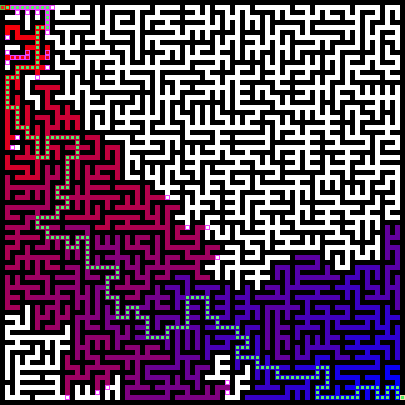

# Trabalho Prático - Inteligência Artificial

Esse trabalho implementa diversos agentes de inteligência artificial focadas em resolver diferentes tipos de labirintos.

     
    <em>Labirinto resolvido com A*</em>

1. Agente Reativo Simples
2. Agente Reativo Baseado em Modelo
3. Agente Baseado em Objetivo (Busca em Profundidade e Largura)
4. Agente Baseado em Utilidade (A* com 3 Heurísticas)

## Instruções para Execução

Acesse o site [da Arena dos Agentes](https://alan-b-lima.github.io/ia) e crie um novo agente, escolhendo o tipo de agente e o labirinto desejado. Em seguida, pressione espaço para iniciar a simulação.

## Análise dos Agentes

Cada agente foi implementado em TypeScript, utilizando geradores, que são funções que podem ser pausadas e retomadas, permitindo a simulação passo a passo do comportamento dos agentes. Logo, a performance dos agentes será analisada com base no número de passos necessários para alcançar o objetivo em diferentes labirintos.

### Agente Reativo Simples

O agente reativo simples toma decisões baseadas apenas na percepção atual do ambiente, sem considerar o histórico ou o estado futuro. Ele foi implementado escolhendo uma direção aleatória entre as disponíveis a cada passo. Assim, o número de passos varia significativamente dependendo do labirinto e da sorte do agente.

### Agente Reativo Baseado em Modelo

O agente reativo baseado em modelo mantém um modelo interno do ambiente, permitindo-lhe tomar decisões mais informadas. Ele registra as posições já visitadas e evita retornar a elas, o que melhora sua eficiência em comparação com o agente reativo simples. No entanto, ainda pode se perder em labirintos complexos. Foi implementado tanto como memória de posições visitadas quanto olha para os estados futuros e escolhe o mais promissor de acordo com alguma heurística. Consegue chegar ao objetivo em menos passos do que o agente reativo simples, dependendo do labirinto, supera até mesmo os agentes baseados em objetivos e utilidade. Porém, ele também se perde em labirintos mais complexos.

### Agente Baseado em Objetivo

O agente baseado em objetivo utiliza algoritmos de busca em profundidade e largura para encontrar o caminho até o objetivo. A busca em largura garante a descoberta do caminho mais curto, enquanto a busca em profundidade pode ser mais rápida, mas não garante o caminho mais curto. Apenas a versão com memória consegue chegar sempre ao objetivo, enquanto a versão sem memória pode entrar em loops infinitos, especialmente a busca em profundidade. O número de passos varia dependendo do labirinto, mas geralmente é maior do que o agente reativo baseado em modelo.

### Agente Baseado em Utilidade

O agente baseado em utilidade utiliza o algoritmo A* com três heurísticas diferentes para encontrar o caminho até o objetivo. As heurísticas implementadas foram a distância de Manhattan, a distância Euclidiana e uma inventada, chamada de Manhattan espiã. A heurística de Manhattan geralmente oferece o melhor desempenho, seguida pela Euclidiana, enquanto a heurística inventada pode consegue ser pior que a Manhattan em todos os labirintos testados.
